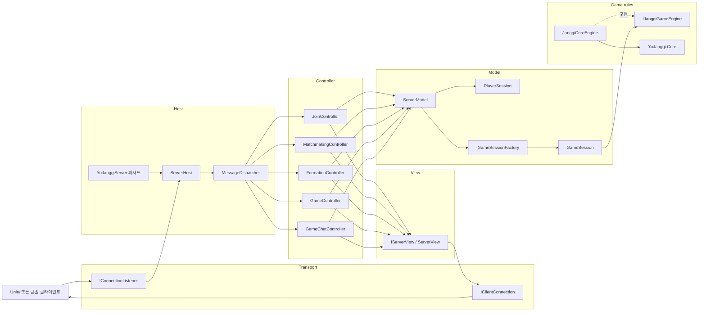
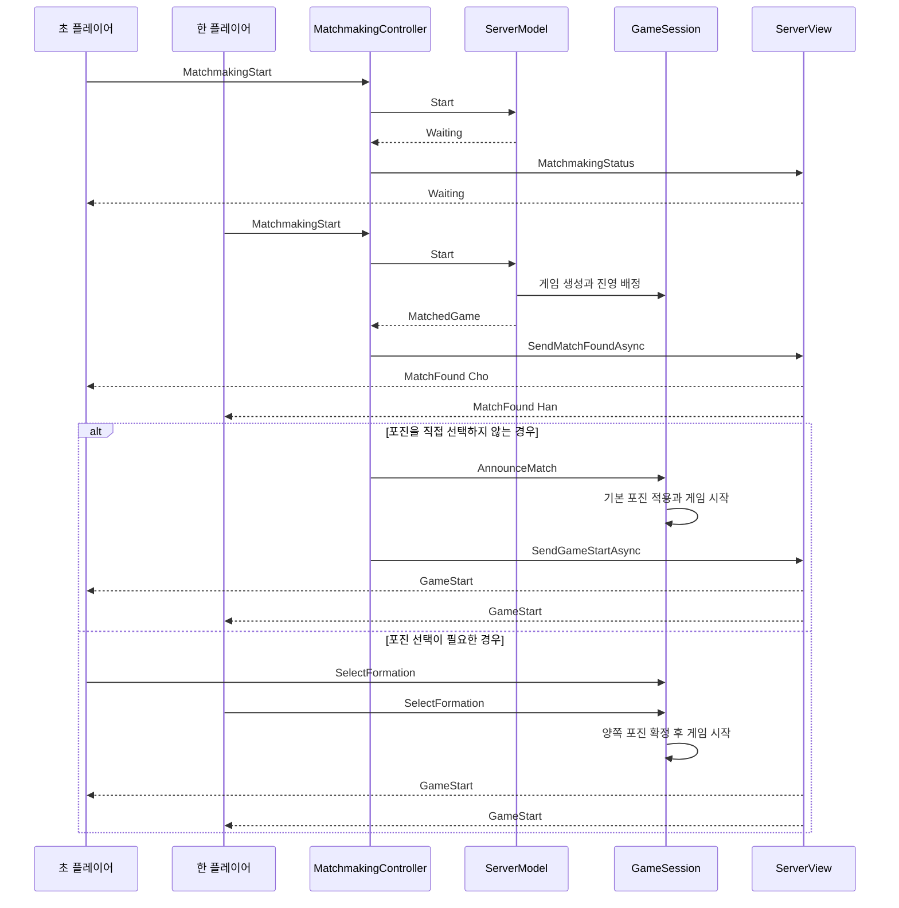

# YuJanggi.Server

.NET 10 기반 장기 게임 서버입니다.

클라이언트의 이동 요청을 서버에서 검증하고, 두 플레이어에게 같은 보드 상태를 전달하는 구조를 구현했습니다.

[Unity](https://github.com/SeokJinYoo98/YuJanggi.Unity) / [Core](https://github.com/SeokJinYoo98/YuJanggi.Core) / [포트폴리오](https://app.notion.com/p/3b48a299d1c481019a37cf5ea2019cdd)

## 주요 기능

- **접속:** 여러 TCP 클라이언트의 비동기 접속과 송수신 처리

- **매칭:** 참가, 매칭 시작과 취소, 초와 한 진영 무작위 배정

  먼저 대기한 두 플레이어를 매칭한 뒤 초와 한을 무작위로 정합니다. 두 클라이언트에 같은 배정 안내를 전달합니다.

- **대국:** 합법 수 조회, 이동 검증, 전체 보드 상태 전송

- **채팅:** 같은 대국에 참가한 플레이어 간 메시지 전송

- **종료:** 연결 종료 시 대기열과 게임 세션 정리

## 설계에서 집중한 점

- **서버에서 최종 검증:** 참가자, 턴, 좌표와 소유권을 확인하고 Core로 합법 수를 판정합니다. 성공한 이동만 양쪽에 전달합니다.

- **게임 상태 분리:** 대국마다 GameSession과 Core 인스턴스를 두고, 게임별 Lock으로 조회와 이동 요청을 순차 처리합니다.

- **TCP 메시지 경계 처리:** 길이 헤더로 패킷을 구분하고 연결별 송신 제어로 메시지 바이트가 섞이지 않도록 했습니다.

- **공용 메시지 계약:** 요청과 응답을 YuJanggiCommon으로 분리해 서버와 클라이언트가 같은 DTO를 사용하도록 구성했습니다.

## 서버 구조

서버는 TCP 요청과 응답을 처리하는 환경에 맞춰 MVC 구조를 적용했습니다. 화면 대신 클라이언트에 보낼 네트워크 응답을 View로 정의하고, 연결과 게임 규칙은 인터페이스 뒤에 배치했습니다.



### 디렉터리 구성

| 디렉터리 | 역할 |
| --- | --- |
| `Hosting` | 서버 시작과 종료, 연결 수락, 클라이언트 작업 수명주기 관리 |
| `Transport` | 연결 수락과 개별 클라이언트 송수신 추상화, TCP 구현 제공 |
| `Controllers` | 메시지 Payload 검증, Model 호출, 응답 선택 |
| `Models` | 플레이어, 매칭 대기열과 게임 세션 저장소 관리 |
| `Game` | 대국 상태, 게임 엔진 인터페이스와 Core 어댑터 관리 |
| `Views` | 처리 결과를 공용 메시지 DTO로 만들고 클라이언트에 전송 |

`YuJanggiServer` 클래스는 기존 생성자와 실행 코드를 유지하기 위한 파사드입니다. 실제 서버 실행은 `ServerHost`가 담당합니다.

### 요청 처리 흐름

1. `IConnectionListener`가 새 연결을 수락합니다. 기본 구현인 `TcpConnectionListener`는 연결마다 `TcpClientConnection`을 생성합니다.
2. `ServerHost`가 연결을 `PlayerSession`으로 감싸 `ServerModel`에 등록하고, 연결별 메시지 처리 작업을 추적합니다.
3. `TcpClientConnection`이 4바이트 길이 헤더와 JSON 본문을 읽어 `ChatMessage`로 변환합니다.
4. `MessageDispatcher`가 `MessageType`에 등록된 `IMessageController`를 찾습니다.
5. Controller가 Payload 형식과 기능별 조건을 검증한 후 필요한 Model 또는 `GameSession`을 호출합니다.
6. `ServerView`가 처리 결과를 `YuJanggiCommon`의 응답 DTO로 만들고 요청자 또는 대국 참가자 모두에게 전달합니다.
7. 연결이 종료되면 `ServerHost`가 플레이어를 대기열과 게임 저장소에서 제거하고, 상대 플레이어에게 대국 종료 이벤트를 전달합니다.

지원하지 않는 메시지 타입은 Dispatcher에서 `UnsupportedMessageType` 오류로 처리합니다. 서버가 클라이언트에 보내는 이벤트 타입을 클라이언트가 요청으로 전송한 경우도 같은 경로로 거부합니다.

### MVC 계층별 책임

#### Model

`PlayerSession`은 플레이어 ID, 이름, 현재 게임 ID와 진영을 관리합니다. 네트워크 구현은 `IClientConnection`으로 보관하므로 플레이어 상태가 `TcpClient`에 직접 의존하지 않습니다.

`ServerModel`은 다음 세 개의 좁은 인터페이스를 구현합니다.

- `IPlayerRegistry`: 참가 처리와 중복 이름 검사
- `IMatchmakingService`: 매칭 참가, 취소, 대기 순서와 진영 추첨
- `IGameSessionRegistry`: 플레이어가 참가 중인 게임 검색

하나의 Model이 실제 상태를 관리하지만 Controller는 필요한 인터페이스만 받습니다. 참가 Controller는 매칭 대기열이나 게임 저장소를 직접 조작할 수 없습니다.

`GameSession`은 한 대국의 두 참가자, 포진 선택, 시작 여부와 종료 여부를 관리합니다. 게임 규칙 실행은 직접 구현하지 않고 `IJanggiGameEngine`에 위임합니다.

#### Controller

| Controller | 처리하는 요청 | 주요 책임 |
| --- | --- | --- |
| `JoinController` | `Join` | 이름 형식, 길이와 중복 여부 검증 |
| `MatchmakingController` | `MatchmakingStart`, `MatchmakingCancel` | 대기열 참가·취소, 매칭 결과와 게임 시작 처리 |
| `FormationController` | `SelectFormation` | 참가 게임과 포진 값 검증, 양쪽 선택 완료 후 시작 |
| `GameController` | `LegalMovesRequest`, `MoveRequest` | 좌표와 대국 상태 검증, 게임 엔진 호출 |
| `GameChatController` | `GameChatSend` | 채팅 길이와 대국 참가 여부 검증, 참가자에게 전달 |

각 Controller는 `SupportedTypes`로 처리할 메시지를 선언합니다. `MessageDispatcher`는 이 정보를 사용해 메시지와 Controller를 연결하므로 서버 호스트에 기능별 `switch` 문이 필요하지 않습니다.

#### View

`IServerView`는 Controller가 네트워크 세부 구현을 알지 않고 응답을 전달할 수 있도록 합니다. 기본 `ServerView`는 다음 응답을 담당합니다.

- 일반 성공 응답과 오류 응답
- 양쪽 플레이어에게 동일한 매칭 결과 전달
- 초와 한의 시점에 맞는 게임 시작 정보 전달
- 이동 결과와 전체 보드 상태 동시 전송
- 게임 채팅과 상대 연결 종료 이벤트 전송

응답에 사용하는 DTO와 메시지 타입은 `YuJanggiCommon`에 정의되어 Unity, 콘솔 클라이언트와 서버가 같은 계약을 공유합니다.

### 게임 엔진과 Core 경계

`IJanggiGameEngine`은 서버에서 필요한 장기 규칙 기능만 제공합니다.

- 선택한 포진으로 보드 초기화
- 게임 시작과 현재 턴 조회
- 선택한 기물의 합법 수 조회
- 이동 검증과 적용
- 클라이언트에 전달할 보드 스냅샷 생성
- 게임 종료 시 Core 이벤트 해제

`JanggiCoreEngine`은 이 인터페이스를 구현하고 `YuJanggi.Core`의 `MatchModel`, `BoardModel`, `JanggiRule`을 조합합니다. Common과 Core에 별도로 선언된 진영, 포진과 기물 타입은 명시적인 변환 함수로 연결합니다. 따라서 enum 선언 순서가 바뀌어도 다른 포진이나 기물로 조용히 변환되지 않습니다.

`IGameSessionFactory`는 새 대국이 생성될 때 사용할 게임 엔진을 결정합니다. 테스트에서는 가짜 엔진을 주입해 TCP 연결이나 실제 보드 없이 포진 선택과 게임 시작 상태를 검증할 수 있습니다.

### 교체 가능한 인터페이스

| 인터페이스 | 기본 구현 | 교체 목적 |
| --- | --- | --- |
| `IConnectionListener` | `TcpConnectionListener` | 연결 수락 방식 변경 |
| `IClientConnection` | `TcpClientConnection` | 개별 연결의 송수신 방식 변경 또는 테스트 대역 사용 |
| `IMessageController` | 기능별 Controller | 새로운 요청 기능 추가 |
| `IPlayerRegistry` | `ServerModel` | 사용자 저장과 참가 정책 변경 |
| `IMatchmakingService` | `ServerModel` | 등급전, 방 코드 등 다른 매칭 정책 적용 |
| `IGameSessionRegistry` | `ServerModel` | 게임 저장 방식 변경 |
| `IGameSessionFactory` | `GameSessionFactory` | 게임 엔진 또는 세션 생성 정책 변경 |
| `IJanggiGameEngine` | `JanggiCoreEngine` | 규칙 구현 교체 또는 독립 테스트 |
| `IServerView` | `ServerView` | 응답 생성 및 전달 방식 변경 |

### 매칭과 게임 시작



매칭 대기 순서는 유지하지만 초와 한은 무작위로 정합니다. 포진을 직접 선택하지 않은 참가자에게는 기본 포진 `EHHE`를 적용합니다. 양쪽 모두 직접 선택하도록 요청했다면 두 선택이 완료되기 전까지 이동 요청은 `GameNotStarted` 오류로 거부합니다.

### 동시성과 종료 처리

- `ServerModel`의 잠금은 연결 목록, 매칭 대기열과 게임 저장소 변경을 한 번에 보호합니다.
- `GameSession`의 게임별 잠금은 포진 선택, 합법 수 조회와 이동 요청을 같은 대국 안에서 순차 처리합니다. 서로 다른 대국은 별도의 잠금을 사용합니다.
- `TcpClientConnection`의 송신 잠금은 같은 연결에 여러 응답이 동시에 기록되어 패킷이 섞이는 것을 방지합니다.
- `ServerHost`는 연결별 처리 Task를 추적하고 `CancellationToken`을 전달합니다. 종료 시 새 연결 수락을 중단하고 게임과 플레이어 연결을 정리합니다.
- `clientClear` 실행 중에는 신규 연결 등록을 잠시 막아 정리되는 상태와 새 세션이 섞이지 않게 합니다.

### 기능 확장 방법

새로운 메시지를 추가할 때는 다음 순서로 변경합니다.

1. `YuJanggiCommon`에 요청과 응답 DTO 및 `MessageType`을 정의합니다.
2. `IMessageController` 구현을 만들고 처리할 타입을 `SupportedTypes`에 선언합니다.
3. 기본 서버 구성에서 새 Controller를 `MessageDispatcher`에 등록합니다.
4. Controller 단위 테스트와 필요한 TCP 통합 테스트를 추가합니다.
5. Common을 사용하는 Unity와 콘솔 클라이언트의 역직렬화 호환성을 확인합니다.

전송 방식을 바꾸려면 `IConnectionListener`와 `IClientConnection`을 구현해 `ServerHost`에 주입합니다. 장기 규칙 실행 방식을 바꾸려면 `IJanggiGameEngine` 구현을 만든 뒤 `GameSessionFactory`의 엔진 팩터리로 전달합니다. 이 경계 덕분에 Controller와 Model을 실제 소켓이나 Core 구현 없이 테스트할 수 있습니다.

## 실행

Git과 .NET SDK 10이 필요합니다.

저장소를 받은 뒤 아래 공용 패키지 인증을 설정합니다.

```powershell
git clone https://github.com/SeokJinYoo98/YuJanggi.Server.git
cd YuJanggi.Server
```

서버를 실행합니다.

```powershell
dotnet run --project .\YuJanggiServer\YuJanggiServer.csproj
```

별도 터미널 두 개에서 콘솔 클라이언트를 실행하면 대국 흐름을 확인할 수 있습니다.

```powershell
dotnet run --project .\YuJanggiClient\YuJanggiClient.csproj
```

서버는 TCP 7777 포트를 사용합니다.

매칭 안내와 기존 메시지 호환성 테스트를 실행합니다.

```powershell
dotnet test .\Tests\YuJanggi.Server.Tests.csproj
```

## 통신 방식

패킷은 4바이트 Big Endian 길이와 UTF-8 JSON 본문으로 구성됩니다.

JSON 본문의 최대 크기는 4 KiB입니다.

이동 결과에는 전체 보드 상태를 포함합니다. 상태 버전과 재접속 시 재동기화는 아직 지원하지 않습니다.

## 콘솔 명령

- **서버:** clientList, clientClear

- **클라이언트:** select x z, move x z, 일반 채팅, /quit

## 현재 상태

- 콘솔 클라이언트 기준 참가, 매칭, 이동, 채팅 흐름을 실행할 수 있습니다.

- Unity 클라이언트의 온라인 대국 연결은 진행 중입니다.

- 재접속, 상태 재동기화, 인증, 암호화, 전적 저장은 구현되지 않았습니다.

- 정상 종료, 기권, 시간패의 전체 네트워크 흐름은 추가 구현이 필요합니다.

- Core는 NuGet으로 참조하며 Unity UPM과 동일한 배포 소스 버전을 사용해야 합니다.

## 공용 패키지

서버는 GitHub Packages의 YuJanggi.Core 0.1.0과 YuJanggi.Protocol 1.0.0을 사용하며, 콘솔 클라이언트는 Protocol 1.0.0을 사용합니다. csproj의 정확한 버전 지정과 packages.lock.json을 함께 갱신합니다. Unity는 Core v0.1.0 / Protocol upm/v1.0.0 태그를 사용해야 합니다.

nuget.config에는 소스 주소와 패키지 매핑만 있습니다. 개발 PC에서 GitHub PAT classic(read:packages)을 사용자 NuGet 설정에 등록하세요. Windows PowerShell 7 예시:

```powershell
$packageToken = Read-Host "GitHub PAT" -MaskInput
dotnet nuget add source "https://nuget.pkg.github.com/SeokJinYoo98/index.json" --name github --username SeokJinYoo98 --password $packageToken
Remove-Variable packageToken
```

사용자 설정에 github가 이미 있으면 add 대신 update source github를 사용합니다. 토큰을 저장소 nuget.config에 쓰지 마세요. CI에서는 패키지 읽기 권한을 부여하고 NuGetPackageSourceCredentials_github 환경 변수로 인증을 전달합니다.

```powershell
dotnet restore ./YuJanggiServer.sln --locked-mode
dotnet restore ./Tests/YuJanggi.Server.Tests.csproj --locked-mode
dotnet test ./Tests/YuJanggi.Server.Tests.csproj -c Release --no-restore
```

기존 Core 서브모듈은 로컬 변경 보존을 위해 남아 있으나 빌드·솔루션 참조에서 제외했습니다. 수동 Protocol DLL 복사는 더 이상 사용하지 않습니다. 패키지 변경 시 참가·매칭·포진·이동·상대 연결 종료 통합 테스트를 실행하세요.
