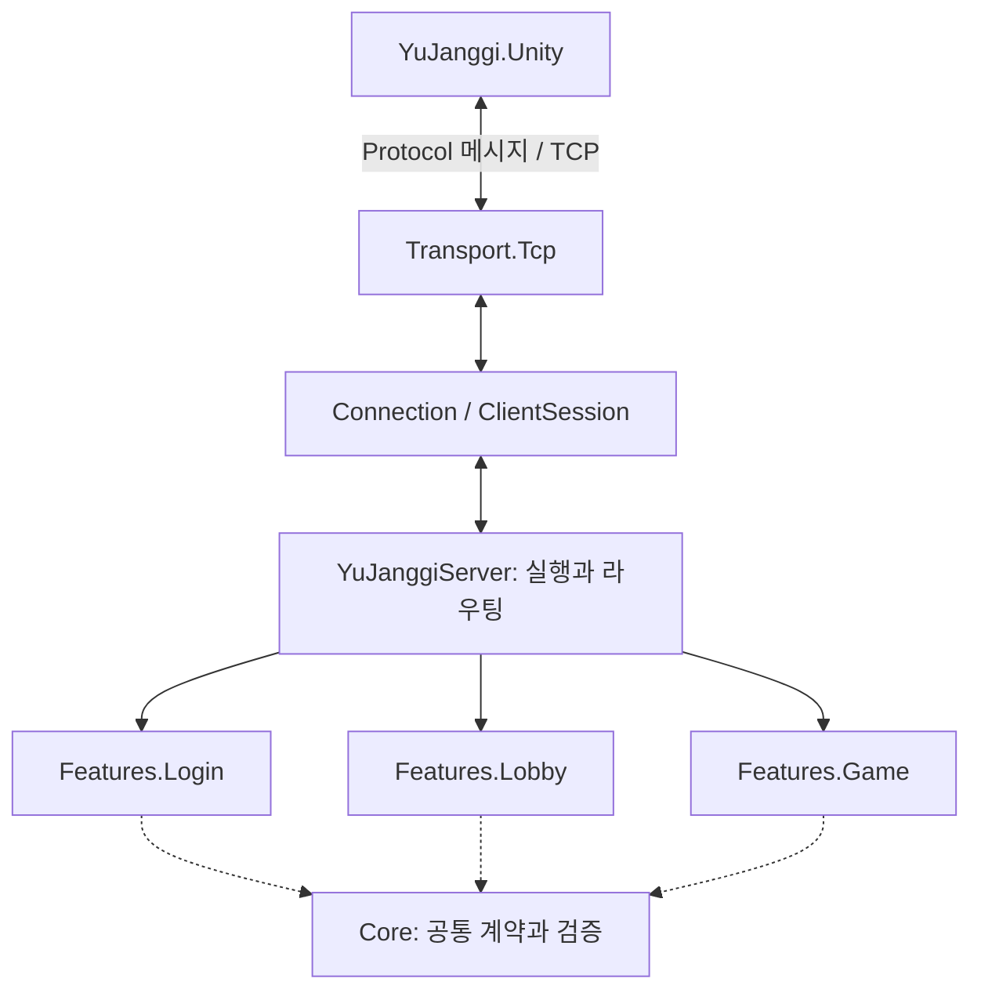
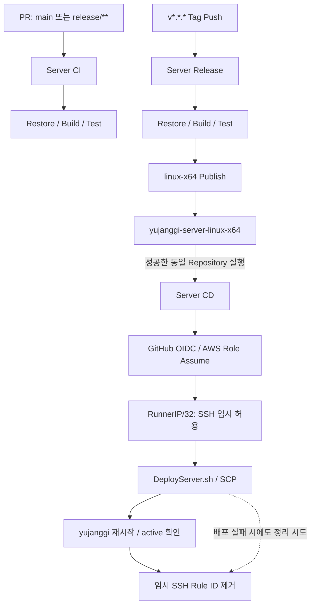

# YuJanggi.Server

.NET 10 기반 1:1 장기 네트워크 서버입니다. TCP 연결과 세션, 매칭·포진 준비, 게임 시작·이동 메시지 전달·종료 정리를 처리하며, Tag 기반 Linux 배포 결과물을 GitHub Actions에서 생성해 AWS EC2로 배포합니다.

- **기능별 책임 분리**: `Features/Login`, `Features/Lobby`, `Features/Game`에 유스케이스와 상태 배치
- **공유 계약과 기반 기능 분리**: Core의 공통 계약, Connection의 세션 수명주기, Transport의 byte 송수신
- **CI/CD**: PR 검증 → Tag 기반 Linux Artifact 생성 → OIDC 인증과 임시 SSH 허용을 통한 EC2 배포

현재 서버의 이동 처리는 요청을 승인하고 참가자에게 전달하는 단계입니다. Engine을 통한 기물·턴·이동 합법성 검증과 서버 자체 결과 계산은 아직 구현하지 않았습니다.

## 전체 구조


```mermaid
flowchart TD
    CLIENT[YuJanggi.Unity] <-->|Protocol 메시지 / TCP| TCP[Transport.Tcp]
    TCP <--> SESSION[Connection / ClientSession]
    SESSION <--> SERVER[YuJanggiServer: 실행과 라우팅]
    SERVER --> LOGIN[Features.Login]
    SERVER --> LOBBY[Features.Lobby]
    SERVER --> GAME[Features.Game]
    LOGIN -.-> CORE[Core: 공통 계약과 검증]
    LOBBY -.-> CORE
    GAME -.-> CORE
```

`YuJanggiServer`가 연결 수락, 도메인 조립, 메시지 라우팅, Disconnect / shutdown 정리 순서를 조정합니다. Transport는 TCP와 Protocol 직렬화·Framing을 처리하고, ClientSession은 연결 식별자와 Handshake 상태를 보관하며 송수신을 위임합니다.

핵심 기술은 C# / .NET 10, TCP / NetworkStream, async / await, MSTest, GitHub Actions, AWS OIDC, EC2, systemd입니다. 메시지 계약은 `YuJanggi.Protocol` NuGet 패키지를 사용합니다.

## Features의 공통 책임 구조

Login·Lobby·Game을 사용자의 기능 흐름 단위로 묶고, 각 기능에서 다음 책임 구분을 따릅니다.

```text
Handler → Service → Manager → Domain Object
```

이는 공통 상속 계층이 아니라 코드를 배치하고 책임을 나누는 규칙입니다. 실제 호출은 유스케이스에 따라 Service가 Manager와 상태 객체를 함께 사용합니다.

| 계층 | 공통 책임 | 현재 예시 |
| --- | --- | --- |
| Handler | Protocol 경계, 요청 검증, Service 호출, Response / Event 생성·전송 | `ProtocolHandshakeHandler`, `LobbyHandler`, `GameHandler` |
| Service | 유스케이스 판단, 상태 변경 조정, 처리 결과와 전송 대상 반환 | `LoginService`, `LobbyService`, `GameService` |
| Manager | 컬렉션 등록·조회·제거와 컬렉션 동시성 보호 | `LoginManager`, `LobbyManager`, `GameRoomManager` |
| Domain Object | 해당 기능의 상태·데이터 원본과 무결성 | `AuthenticatedUser`, `MatchState`, `GameRoom` |

각 Feature는 `Handler/`, `Service/` 폴더를 두고 Manager와 상태 객체는 Feature 안에 배치합니다. 메시지 전송 형식과 상태 판단을 분리해, 기능을 추가할 때 기존 기능의 책임 구분을 참고할 수 있도록 구성했습니다. 빈 BaseHandler / BaseService / BaseManager나 Generic Manager는 사용하지 않습니다.

### Core — 실제 공유 계약

| 공통 코드 | 역할 |
| --- | --- |
| [`IMessageHandler`](src/Core/Messaging/IMessageHandler.cs) | 세 Handler가 구현하는 `HandleAsync` 계약 |
| [`RequestMessageValidation`](src/Core/Messaging/RequestMessageValidation.cs) | Lobby / Game 요청의 비어 있는 RequestId 검증 |
| [`IClientSession`](src/Core/Sessions/IClientSession.cs) | 여러 기능에서 사용하는 세션 정보·송수신 계약 |

Core는 Login / Lobby / Game 구체 구현이나 도메인 상태를 소유하지 않습니다. 도메인이 Core를 참조하며, Protocol이 이미 제공하는 메시지 Factory·직렬화 기능은 별도로 중복 구현하지 않습니다.

### Login — Handshake와 인증 연결 준비

[`ProtocolHandshakeHandler`](src/Features/Login/Handler/ProtocolHandshakeHandler.cs)가 요청을 해석하고 `LoginService`에 Protocol·Engine 버전 검증을 맡깁니다. Handler가 `HandshakeResponse`를 전송한 뒤 Service를 통해 Session의 Handshake 완료 상태를 저장합니다.

`LoginManager`는 ClientId와 `AuthenticatedUser`의 연결을 관리하도록 준비되어 있습니다. 현재 로그인 요청, 자격 증명 검증, OAuth, 사용자 DB는 구현하지 않았으며 Handshake 성공을 사용자 인증 성공으로 취급하지 않습니다.

### Lobby — 매칭부터 게임 시작 준비까지

[`LobbyService`](src/Features/Lobby/Service/LobbyService.cs)는 매칭 신청·취소·확정, 포진 제출과 게임 전환을 조정합니다. `LobbyManager`가 FIFO 대기열과 참가자별 매치 인덱스를 관리하고, 두 참가자는 같은 `MatchState`를 참조합니다.

`MatchState`는 매치 ID, 참가자, 초·한 포진과 `GameTransitionCompleted`를 보관합니다. 양측 포진이 완료되면 Service가 `GameRoomManager.CreateGameRoom`을 한 번 호출합니다. 생성 실패 시 이번 제출만 되돌립니다.

`GameTransitionCompleted`는 Lobby → Game 전환 성공 기록입니다. 현재 GameRoom 상태를 복제하지 않으며, 생성 이후의 Room 생명주기는 Game이 담당합니다. Lobby 기록은 중복 요청을 막기 위해 유지하고 Disconnect 또는 종료된 Room을 후속 조회할 때 정리합니다.

### Game — 준비·진행 메시지·종료

[`GameService`](src/Features/Game/Service/GameService.cs)는 양측 준비 확인, 이동 처리 결과, 종료 제출 일치 확인과 Room 종료를 조정합니다. `GameRoomManager`는 Room 생성·조회·제거를 담당하고 `GameRoom`이 참가자·준비·종료 제출 상태와 상태 전이 무결성을 유지합니다.

```text
WaitingForReady → Playing → Ended
→ GameEndedEvent 전송 시도 → Closed → 컬렉션에서 제거
```

정상 종료는 양측 Client가 제출한 승자와 수순 수가 일치할 때 확정합니다. Handler가 `GameEndResponse`를 보내고 `GameEndedEvent`를 전송한 뒤 Service에 정리를 요청합니다. 종료가 확정되면 Response / Event 전송이 실패해도 `finally`에서 Room을 닫고 제거합니다.

## 메시지 순서와 동시성

```text
HandshakeRequest → HandshakeResponse
MatchingStartRequest → 양측 MatchingStartResponse → MatchingFoundEvent
양측 FormationSubmit → GameRoom 생성 → GameReadyEvent
양측 GameSceneReady → GameStartEvent
MovePieceRequest → MovePieceResponse → MovePieceEvent
양측 GameEndRequest → GameEndResponse → GameEndedEvent → Room 정리
```

`FormationSubmit`과 `GameSceneReady`는 RequestId 없는 알림입니다. 포진 확정의 `GameReadyEvent`와 실제 게임 시작의 `GameStartEvent`를 구분합니다.

- LobbyHandler는 양측 매칭 응답의 전송 완료를 기다린 뒤 MatchingFound를 보냅니다. MatchingFound / GameReady는 매치 참가자에게 순차 전송합니다.
- GameHandler는 Response 이후 Room 참가자에게 `Task.WhenAll`로 이벤트를 병렬 전송합니다. 로비 대기자 전체를 대상으로 하는 Broadcast는 현재 구현되어 있지 않습니다.
- Lobby의 lock은 매칭·포진·전환 판단을 보호합니다. GameRoom의 `SyncRoot`는 개별 대국 상태를 보호합니다.
- `_roomSync`는 Room 컬렉션과 Room 생성 / Session 제거 사이의 경쟁을 보호합니다. 네트워크 전송은 이 잠금 밖에서 수행합니다.
- Transport의 `SemaphoreSlim`은 같은 연결에 보내는 패킷이 서로 섞이지 않도록 Send를 직렬화합니다.

## CI/CD

### Server CI — PR 검증

[`ci.yml`](.github/workflows/ci.yml)은 대상 브랜치가 `main` 또는 `release/**`인 Pull Request에서 Ubuntu Runner와 .NET SDK `10.0.x`로 실행합니다.

```text
Pull Request → Restore → Build (Release) → Test
```

[`NuGet.Config`](NuGet.Config)은 Protocol / Engine을 GitHub Packages에서 가져오도록 매핑합니다. Workflow는 `NuGetPackageSourceCredentials_github` 환경변수와 `GITHUB_TOKEN`으로 인증하며, 권한은 `contents: read`, `packages: read`입니다.

### Server Release — Linux 배포 Artifact 생성

[`release.yml`](.github/workflows/release.yml)은 `v*.*.*` Tag Push에서 실행합니다. CI와 같은 Restore / Build / Test를 통과한 뒤 [`PublishServer.sh`](scripts/PublishServer.sh)를 호출합니다.

```text
Tag → Restore → Build → Test → dotnet publish → Artifact 업로드
```

Publish는 `src/YuJanggi.Server.csproj`를 Release / `linux-x64` / `--self-contained false`로 생성합니다. Linux Runtime에 맞는 Restore·Build는 Publish 단계에서 서버 프로젝트를 대상으로 수행합니다. EC2에는 .NET 10 런타임이 필요합니다.

| 항목 | 값 |
| --- | --- |
| Artifact 이름 | `yujanggi-server-linux-x64` |
| 출력 경로 | `artifacts/publish/linux-x64/**` |
| 내용 | `YuJanggi.Server.dll`, deps / runtimeconfig, Protocol·Engine DLL 등 publish 결과 전체 |

Release는 GitHub Release를 생성하거나 EC2에 배포하지 않습니다. Tag 버전을 소스에 덮어쓰는 단계도 없습니다.

### Server CD — EC2 배포

[`cd.yml`](.github/workflows/cd.yml)은 `Server Release` 완료 시 `workflow_run`으로 실행하며, **성공한 Push 실행이고 동일 Repository인 경우**에만 배포합니다. `workflow_run.id`를 지정해 해당 Release Run의 Artifact를 다운로드하며 Build / Test / Publish를 다시 수행하지 않습니다.

```text
Server Release 성공 → 해당 Run의 Linux Artifact 다운로드
→ GitHub OIDC로 AWS Role Assume
→ Runner 공인 IPv4 검증 → TCP 22에 RunnerIP/32 임시 허용
→ DeployServer.sh → 이번 실행에서 생성한 SSH 규칙 제거
```

OIDC 인증과 Security Group 제어는 Workflow가 담당합니다. [`DeployServer.sh`](scripts/DeployServer.sh)는 Artifact 압축·SCP 전송·원격 파일 반영·systemd 재시작을 담당합니다. 알려진 Host Key 검증을 유지하며, SSH Key와 배포 임시 파일은 종료 시 정리합니다.

EC2 임시 경로에 업로드한 뒤 `yujanggi` 서비스를 중지하고 publish 파일을 반영합니다. `systemctl restart yujanggi`와 `is-active --quiet`로 서비스 시작 상태를 확인합니다. 동시 배포는 `server-ec2-deploy` concurrency 그룹으로 직렬화하며 진행 중 배포를 자동 취소하지 않습니다.

AWS Variables는 `AWS_ROLE_ARN`, `AWS_REGION`, `SERVER_SECURITY_GROUP_ID`, 서버 접속·배포 Variables는 `SERVER_HOST`, `SERVER_USER`, `SERVER_DEPLOY_PATH`입니다. SSH Secrets는 `SERVER_PRIVATE_KEY`, `SERVER_KNOWN_HOSTS`를 사용합니다. CD 권한은 `contents: read`, `actions: read`, `id-token: write`이며 장기 AWS Access Key를 사용하지 않습니다.

임시 SSH 규칙은 생성한 Rule ID를 저장해 `always()` 정리 단계에서 해당 규칙만 제거합니다. Runner 강제 종료·규칙 생성 응답 유실 시 잔여 규칙이 생길 수 있으며, 배포 실패 시 자동 롤백은 현재 구현하지 않았습니다.

### 전체 자동화 흐름


```mermaid
flowchart TD
    PR["PR: main 또는 release/**"] --> CI[Server CI]
    CI --> CHECK[Restore / Build / Test]
    TAG["v*.*.* Tag Push"] --> RELEASE[Server Release]
    RELEASE --> VERIFY[Restore / Build / Test]
    VERIFY --> PUBLISH[linux-x64 Publish]
    PUBLISH --> ARTIFACT[yujanggi-server-linux-x64]
    ARTIFACT -->|성공한 동일 Repository 실행| CD[Server CD]
    CD --> OIDC[GitHub OIDC / AWS Role Assume]
    OIDC --> ALLOW["RunnerIP/32: SSH 임시 허용"]
    ALLOW --> DEPLOY[DeployServer.sh / SCP]
    DEPLOY --> SERVICE[yujanggi 재시작 / active 확인]
    SERVICE --> CLEANUP[임시 SSH Rule ID 제거]
    DEPLOY -.->|배포 실패 시에도 정리 시도| CLEANUP
```

## 실행과 운영

.NET 10 SDK와 GitHub Packages 읽기 인증을 준비한 뒤 저장소 루트에서 실행합니다. 인증 정보는 저장소에 기록하지 않습니다.

```bash
dotnet restore YuJanggi.Server.slnx --configfile NuGet.Config
dotnet run --project src/YuJanggi.Server.csproj
```

서버는 TCP `7777`에서 연결을 받습니다. 콘솔에서 `Rooms`로 Room과 참가자 상태를 조회하고 `Clear`로 화면을 정리할 수 있습니다. 시작 시 Engine / Protocol 패키지 버전을 출력합니다.

EC2의 서비스 등록 예시는 [`yujanggi.service`](docs/deploy/systemd/yujanggi.service), 등록 절차는 [systemd 문서](docs/systemd-ec2-ubuntu.md)를 참고합니다. 실제 계정·배포 경로에 맞게 설정해야 하며 서비스의 표준 입력은 비활성화됩니다. 운영 시에는 `systemctl`과 `journalctl -u yujanggi`로 상태·로그를 확인합니다.

## 테스트

[`YuJanggi.Server.Tests`](YuJanggi.Server.Tests)는 .NET 10 / MSTest 4.0.2를 사용하며 실제 기능 책임에 따라 분류합니다.

| 영역 | 검증 대상 |
| --- | --- |
| Connection | Handshake 이전 매칭 제한, Disconnect 시 Session과 Queue 정리 |
| Lobby | FIFO·취소·중복 및 동시 요청, Response → MatchingFound 순서, Formation → GameReady, 전송 실패·취소 경쟁·부분 전송 |
| Game | 양측 Ready의 1회 시작, 임시 Move Response → Event, 종료 제출 검증·불일치 수정, GameEnd 전송 순서와 실패 시 Room 제거 |
| TestSupport | 여러 영역에서 사용하는 세션·통신·메시지 검증 helper |

Move 테스트는 현재 전달 흐름을 검증하며 Engine 기반 합법성 검증이 완료됐다고 가정하지 않습니다.

## 프로젝트 구조

```text
YuJanggi.Server/
├─ src/
│  ├─ Core/                  # Messaging / Sessions 공통 계약
│  ├─ Transport/Tcp/         # TCP Accept, Framing, byte 송수신
│  ├─ Connection/            # Session 생성·등록·해제
│  ├─ Features/
│  │  ├─ Login/              # Handler / Service / Manager / 사용자 데이터
│  │  ├─ Lobby/              # Handler / Service / Manager / MatchState
│  │  └─ Game/               # Handler / Service / Room Manager / GameRoom / State
│  ├─ Server/                # 실행·라우팅·도메인 간 정리 조정
│  ├─ View/                  # 메시지·버전·Room 콘솔 출력
│  ├─ Program.cs
│  └─ YuJanggi.Server.csproj
├─ YuJanggi.Server.Tests/     # Connection / Lobby / Game / TestSupport
├─ .github/workflows/        # Server CI / Release / CD
├─ scripts/                  # Linux Publish / SSH 배포
├─ docs/                     # systemd 등록 문서와 서비스 예시
├─ NuGet.Config              # GitHub Packages / nuget.org 소스 매핑
└─ YuJanggi.Server.slnx
```

## 현재 구현 범위

연결·Handshake, 매칭·포진 준비, 게임 시작, 이동 메시지 전달, 양측 종료 합의와 Room 정리까지 구현되어 있습니다. 사용자 인증과 Engine 기반 서버 검증은 별도 구현이 필요합니다. Lobby 이벤트의 부분 전송 실패 시 상대 알림·재매칭 복구도 현재 완성된 기능으로 간주하지 않습니다.

## 관련 프로젝트

- **YuJanggi.Unity**: 입력·화면과 Client 네트워크 흐름
- **YuJanggi.Protocol**: 공유 메시지 계약, JSON 직렬화와 Packet Framing
- **YuJanggi.Engine**: 장기 규칙과 게임 진행. 서버는 현재 포진 타입과 패키지 버전을 사용하며 이동 검증은 아직 연동하지 않음
